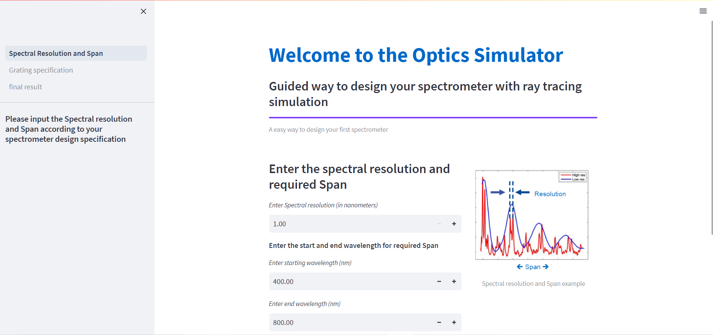
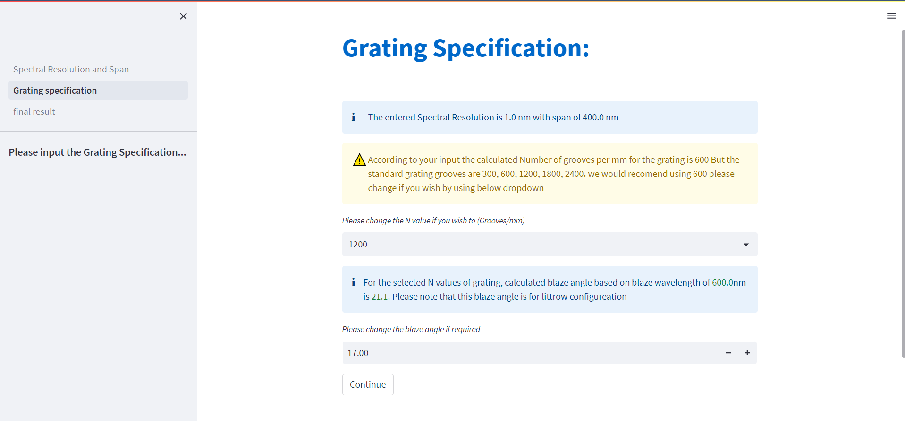
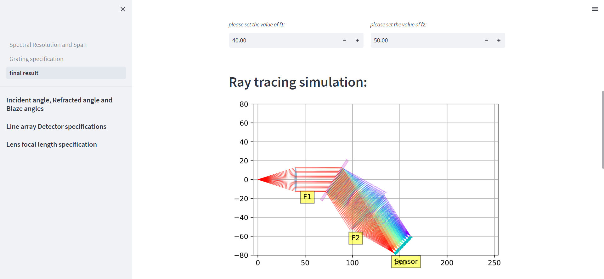
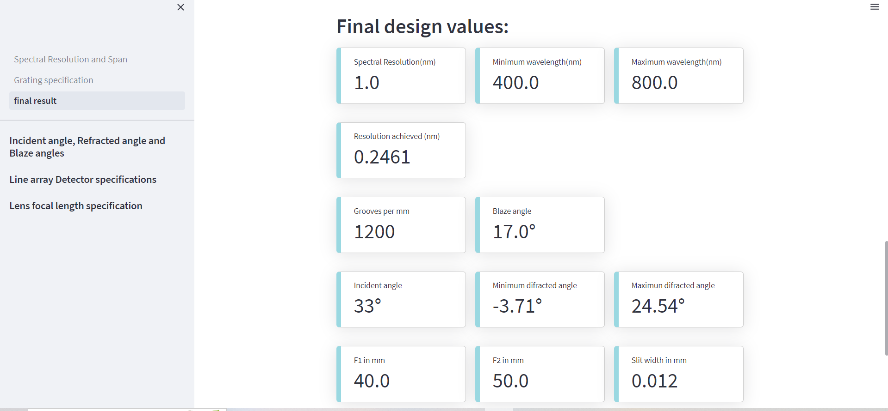

# Welcome to the Optics simulator webapp.

- designing the spectrometer or buying an spectrometer is always a costly affair, after buying the components required to build a spectrometer and realizing that they are not suitable or fit for your requiremnt, here in our simulater you can go through the guided steps to arrive at your required specification for the design you are thinking off, and then proceed with the purchase of sugested comopnents along with visualization of raytracing simulatation.

## Link: [Webapp](https://millermuttu-optics-simulato-spectral-resolution-and-span-3v3azi.streamlit.app/)
## Here are some screen shot of the webapp.

